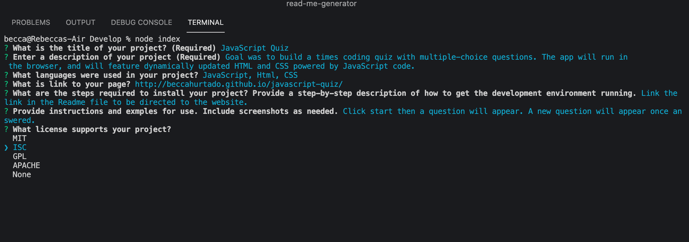

# README Generator
  
  
  
  

  # Description

  Generates a professional readme file once questiona have been answered. Answering all questions is suggested for a better outcome.
  JavaScript

  # Table Of Contents
  * [Installation](#instalation)
  * [Usage](#usage)
  * [License](#license)
  * [Contributing](#contributing)
  * [Test](#test)
  * [Questions](#questions)
  
  # Installation
   The user will need to clone this repository then open the application and navigate to the develop folder. Run terminal from the develop folder and run the command 'npm init'. Then, run the command 'npm i inquirer' and finally 'node index' to be prompted with the questions.
  
  # Usage
   Once questions appear on terminal, the user will answer them as best and they can and will be promped with 'Readme file created!' as the last line if everything ran correctly. A readme file will be created within the develop folder for the user to see. A screenshot of the project can also be inserted as long as it follows the name 'screenshot.png'.
  

  # License
  

  # Contributing
  If you would like to contribute, read over the contributor covenant located below. Send further questions to rebeccah7.rh@gmail.com regarding contribution.
  

  # Tests
  No tests at the moment.

  # Questions
   If you have any questions or issues with the generator, visit https://github.com/BeccaHurtado/read-me-generator to create a new issue. You can also contact me at rebeccah7.rh@gmail.com for any additional questions.
  